# Manufacturing & Industry 5.0 - Prescriptive Maintenance RAG Agent

This project is an **Agentic Retrieval-Augmented Generation (RAG)** system built for prescriptive maintenance workflows in manufacturing environments.

While predictive maintenance solutions successfully detect machine anomalies and flag upcoming failures, they do not tell maintenance teams **how to fix them**. Engineers must still manually search through hundreds of pages of dense technical manuals to locate step-by-step procedures.

This application automates that workflow. When a simulated IoT telemetry anomaly occurs, the AI system matches the specific machine type and error code, retrieves relevant context from the vector database, and generates operational instructions.

The pipeline produces:

- Step-by-step repair tasks
- Required safety tools
- Exact spare part recommendations
- Automated maintenance work orders
- Tracking notifications to keep plant floor operations running smoothly

---

# Table of Contents

- [Quick Start](#quick-start)
- [Project Overview](#project-overview)
- [User Personas](#user-personas)
- [System Architecture](#system-architecture)
- [Technology Stack](#technology-stack)
- [Installation Guide](#installation-guide)
- [Environment Variables](#environment-variables)
- [Application Workflow](#application-workflow)
- [Project Screenshots](#project-screenshots)
- [Demo](#demo)
- [API Documentation](#api-documentation)
- [Configuration](#configuration)
- [EmailJS Setup](#emailjs-setup)
- [Troubleshooting](#troubleshooting)
- [Current Limitation](#current-limitation)
- [Future Improvements](#future-improvements)
- [Contributors](#contributors)
- [License](#license)
- [Acknowledgements](#acknowledgements)

---

# Quick Start

Get the application running locally by executing these commands sequentially.

## Clone the Repository

```bash
git clone https://github.com/your-organization/prescriptive-maintenance-rag.git
```

## Get into the directory

```bash
cd prescriptive-maintenance-rag
```

### Backend Setup

Create the backend environment configuration file.

### Linux / macOS

```bash
cp .env.example .env
```

### Windows (PowerShell)

```powershell
Copy-Item .env.example .env
```

### Windows (Command Prompt)

```cmd
copy .env.example .env
```

Open the newly created `.env` file in the project root and add your API keys.

Create a virtual environment:

```bash
python -m venv .venv
```

Activate the virtual environment.

### Linux / macOS

```bash
source .venv/bin/activate
```

### Windows (PowerShell)

```powershell
.venv\Scripts\Activate.ps1
```

### Windows (Command Prompt)

```cmd
.venv\Scripts\activate.bat
```

Install backend dependencies.

```bash
pip install -r requirements.txt
```

Move into the backend directory:

```bash
cd backend
```

Start the FastAPI server.
```bash
uvicorn main:app --reload
```

---

## Frontend Setup

Open a new terminal window.

Move to the frontend folder.

```bash
cd frontend
```

Create the frontend environment configuration.

### Linux / macOS

```bash
cp .env.example .env
```

### Windows (PowerShell)

```powershell
Copy-Item .env.example .env
```

### Windows (Command Prompt)

```cmd
copy .env.example .env
```

Set:

```text
VITE_API_URL=http://localhost:8000
```

and your EmailJS credentials inside the `.env` file.

Install dependencies.

```bash
npm install
```

Run the development server.

```bash
npm run dev
```

Open your browser and navigate to:

```
http://localhost:5173
```

---


# Project Overview

## Problem Statement

Predictive maintenance systems notify engineering teams that a factory machine is approaching failure.

However, they do not provide contextual instructions on how to perform the actual physical repair.

When an alert fires, engineers must manually look up fault signatures within extensive PDF maintenance manuals, increasing downtime and delaying emergency responses.

---

## Solution

This application implements an **Agentic RAG** system that:

- Ingests simulated IoT telemetry
- Processes the machine profile
- Executes semantic search over a localized vector store populated with parsed machinery manuals
- Combines telemetry with matching reference data
- Generates precise prescriptive maintenance instructions
- Verifies spare parts stock levels
- Dispatches maintenance work orders without manual lookups

---

## Project Metrics

### Business Goal

Reduce **Mean Time To Repair (MTTR)** on the plant floor.

### Success Metric

**Retrieval Accuracy**

The capability to locate exact manual subsections matching the mechanical fault profile without hallucinating standard operating procedures.

---

# User Personas

| Persona | Operational Need | Workflow Lifecycle |
|----------|------------------|--------------------|
| **Maintenance Technician** | Wants instant, accurate repair instructions on the factory floor during an equipment alert. | 1. Receives automated telemetry alert.<br>2. Opens AI Assistant interface.<br>3. Gets step-by-step SOP and parameters.<br>4. Executes machine repair. |
| **Plant Manager** | Wants to minimize manufacturing downtime and automate downstream maintenance tracking. | 1. Reviews prescriptive recommendations.<br>2. Verifies and issues automated work orders.<br>3. Monitors ongoing maintenance progress across dashboards. |

---

# System Architecture

## Core Component Diagram

```text
+---------------------------------------------------------------------------------------+
|                                  CLIENT LAYER (React UI)                              |
|   +-----------------------+     +------------------------+    +-------------------+   |
|   | Industrial Dashboard  | <-- | Telemetry Monitoring   | -- | Analytics Suite   |   |
|   +-----------------------+     +------------------------+    +-------------------+   |
+--------------------------------------------|------------------------------------------+
                                             | HTTP REST / JSON
                                             v
+---------------------------------------------------------------------------------------+
|                               CORE BACKEND LAYER (FastAPI)                            |
|   +-------------------------------------------------------------------------------+   |
|   |                              REST Controllers / API                           |   |
|   +-------------------------------------------------------------------------------+   |
|           |                                 |                                 |        |
|           v                                 v                                 v        |
|   +---------------+                 +---------------+                 +---------------+ |
|   | Vector Search |                 | LLM Synthesis |                 | Report Engine | |
|   | Engine        |                 | Engine        |                 | (ReportLab)   | |
|   +---------------+                 +---------------+                 +---------------+ |
+-----------|---------------------------------|---------------------------------|---------+
            | Embedding Query                 | Generation Prompt               | Binary Generation
            v                                 v                                 v
+-----------------------+         +-----------------------+         +-------------------+
|     VECTOR STORE      |         |   EXTERNAL AI LAUNCH  |         |    LOCAL SYSTEM   |
|  (ChromaDB Local)     |         | (MistralAI/OpenAI API)|         |   (Disk Storage)  |
+-----------------------+         +-----------------------+         +-------------------+
```

---

## System Data Flow

```text
[Telemetry Alert Triggered]
           │
           ▼
[FastAPI Parse Endpoint]
           │
           ▼
(Extract Asset ID & Fault Code)
           │
           ▼
[ChromaDB Query]
           │
           ▼
(Cosine Similarity on Metadata Filter: asset_id)
           │
           ▼
[Context Injection]
           │
           ▼
(Combine Top-K Chunks + Current Telemetry State)
           │
           ▼
[LLM Processing Pipeline]
           │
           ▼
(Enforce Strict Structured Output Schema)
           │
           ▼
[Structured Response]
     ├── Generate Work Order & Map Inventory
     ├── Compile PDF Report via ReportLab
     └── Trigger Client-Side EmailJS Alert
```

---

# Technology Stack

| Layer | Component | Technology | Rationale |
|------|-----------|------------|-----------|
| **Frontend** | Framework | React 18 + Vite | Low-latency client application architecture featuring efficient bundle distribution. |
| | Interface Styling | Native CSS | Standard layout composition utilizing raw CSS custom properties. |
| **Backend** | REST Gateway | FastAPI | Python framework using asynchronous ASGI routing and Pydantic schema validation. |
| | Application Host | Uvicorn | Production-ready ASGI server implementation for handling concurrent network lines. |
| **AI / RAG** | Document Parser | LlamaParse | Handles complex structural layouts and formatting tables from technical manual PDFs. |
| | Local Embedding | Sentence Transformers | Computes dense vector embeddings locally without calling third-party APIs. |
| | Vector Database | ChromaDB | Lightweight embedded vector store featuring quick metadata indexing. |
| | LLM Integration | LangChain Core | Manages contextual prompt generation architectures and structural formatting rules. |
| **Reporting** | PDF Compiler | ReportLab | Programmatically outputs binary PDF structures for industrial logging and audits. |
| **Alerting** | Message Dispatch | EmailJS | Routes transactional alert notifications straight from user interface events. |

---

 # Installation Guide

## Prerequisites

Ensure your local development environment includes the following before beginning deployment.

| Requirement | Version | Verify Installation |
|-------------|---------|---------------------|
| Python | 3.10.x or 3.11.x | `python --version` |
| Node.js | v18.x.x or later | `node -v` |
| C++ Compiler Tools | GCC/G++ (Linux/macOS) or MSVC (Windows) | Required for building local compiled wheels for ChromaDB |

---

# Step-by-Step Installation

If you have not completed the Quick Start section above, clone the repository and configure the environment files before continuing.

The following sections describe the backend and frontend installation in more detail.

# Environment Variables

## Backend Infrastructure Mapping (`.env` in Project Root)

```ini
LLAMA_CLOUD_API_KEY=llx-XXXXXXXXXXXXXXXXXXXXXXXXXXXXXXXXXXXXXXXXXXXXXXXX
MISTRAL_API_KEY=XXXXXXXXXXXXXXXXXXXXXXXXXXXXXXXX
OPENAI_API_KEY=sk-proj-XXXXXXXXXXXXXXXXXXXXXXXXXXXXXXXXXXXXXXXXXXXXXXXX
```

| Variable | Description |
|----------|-------------|
| `LLAMA_CLOUD_API_KEY` | Authenticates layout structural parsing routines matching LlamaParse cloud endpoints. |
| `MISTRAL_API_KEY` | Grants connectivity to target Mistral AI LLM architectures (such as `mistral-large-latest`). |
| `OPENAI_API_KEY` | Optional alternative configuration variable used if swapping model nodes to execute over OpenAI. |

---

## Frontend UI Mapping (`frontend/.env`)

```ini
VITE_API_URL=http://localhost:8000
VITE_EMAILJS_SERVICE_ID=service_xxxxxxx
VITE_EMAILJS_TEMPLATE_ID=template_xxxxxxx
VITE_EMAILJS_PUBLIC_KEY=xxxxxxxxxxxxxxxxx
```

| Variable | Description |
|----------|-------------|
| `VITE_API_URL` | Target address route sending client fetch actions to the active backend FastAPI node. |
| `VITE_EMAILJS_*` | Complete profile credentials used to verify identities against EmailJS client transaction routers. |

---
# Application Workflow

Follow these steps after completing the [Installation Guide](#installation-guide) to seed the database and run the full system.

---

## 1. Add Technical Manuals

Place your PDF documentation files inside:

```
backend/data/manuals/
```

---

## 2. Start the Backend and Frontend

Start both servers as described in - [Quick Start](#quick-start).

---

## 3. Run the Ingestion Pipeline

With the backend running, trigger manual parsing and vector storage:

```bash
curl -X POST http://127.0.0.1:8000/api/v1/maintenance/ingest
```

This parses all PDFs in `backend/data/manuals/` using LlamaParse and saves the resulting vectors to:

```
backend/data/vector_store/
```

---

## 4. Use the Application

The system is now ready. Navigate to `http://localhost:5173` and use the dashboard to monitor machines, trigger alerts, and receive prescriptive maintenance recommendations.


# Project Screenshots

## Main Dashboard Interface

<!-- Add screenshot here -->
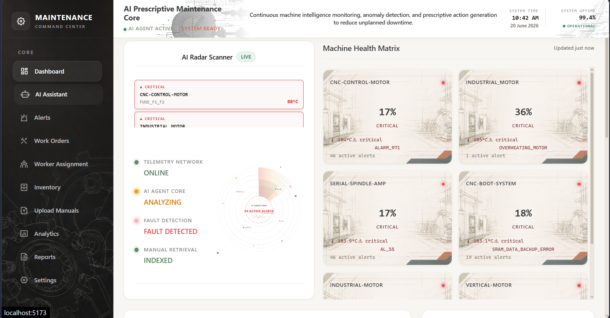

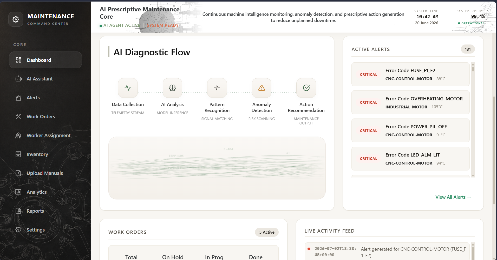

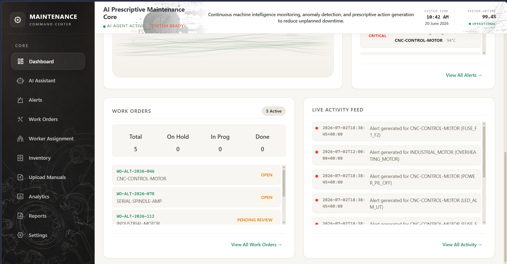

---

## Live Telemetry Alerts

<!-- Add screenshot here -->
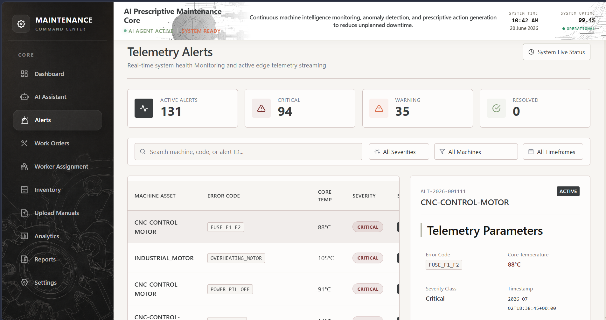

---

## AI Maintenance Assistant

<!-- Add screenshot here -->
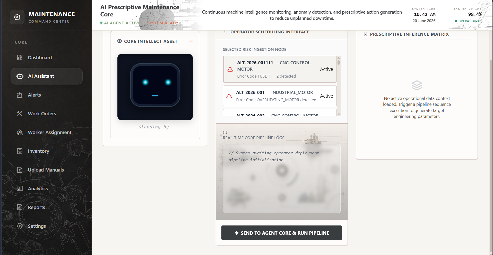

---

## Automated Work Order Generation

<!-- Add screenshot here -->
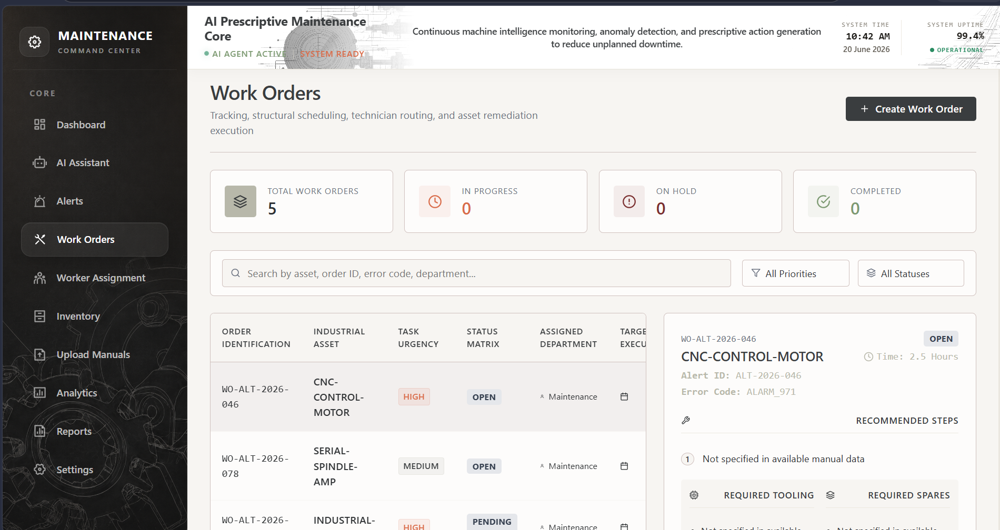

---

## Component Inventory Allocation

<!-- Add screenshot here -->
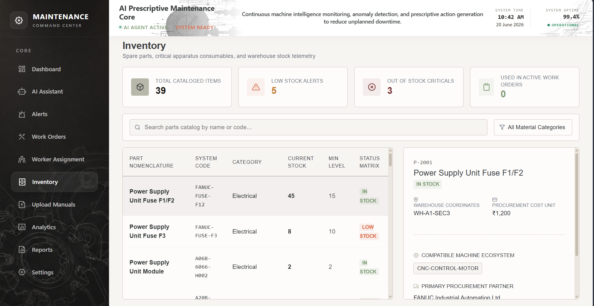

---
## Upload Manuals Section

<!-- Add screenshot here -->
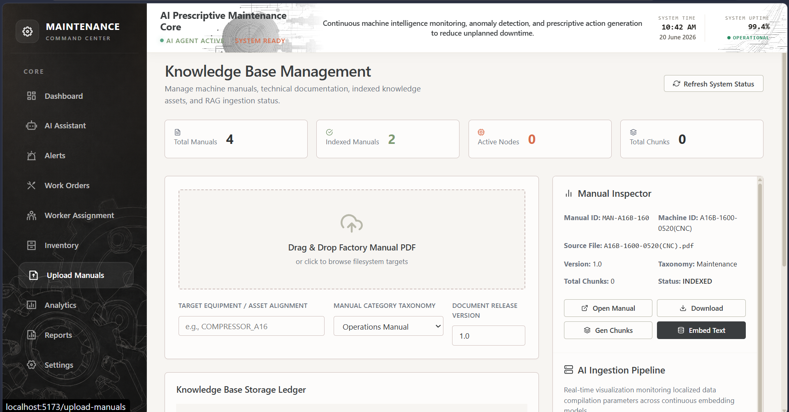

---
## Predictive Analytics Platform

<!-- Add screenshot here -->
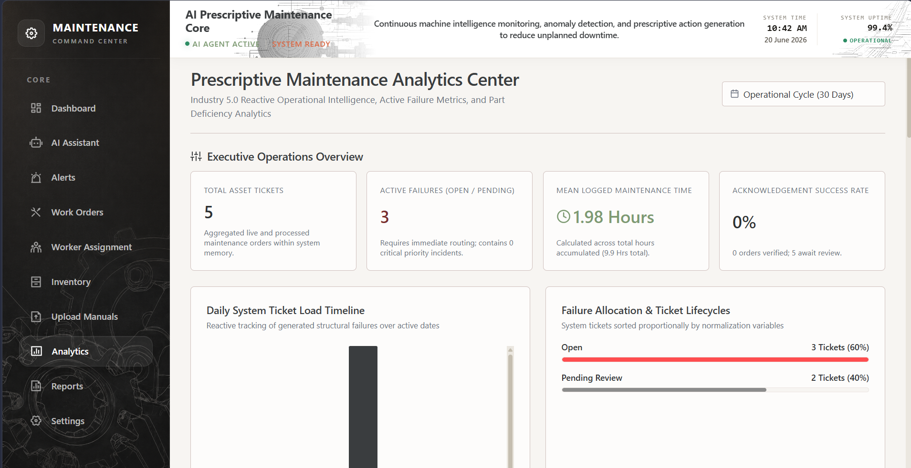

---

## Maintenance Reports Generation

<!-- Add screenshot here -->
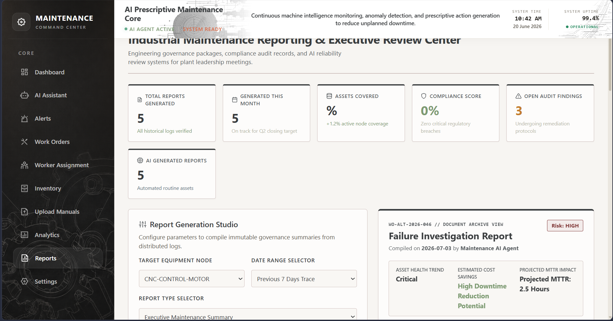

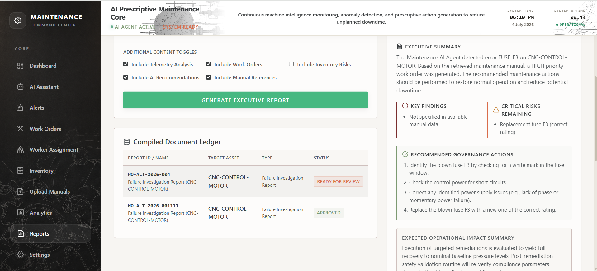

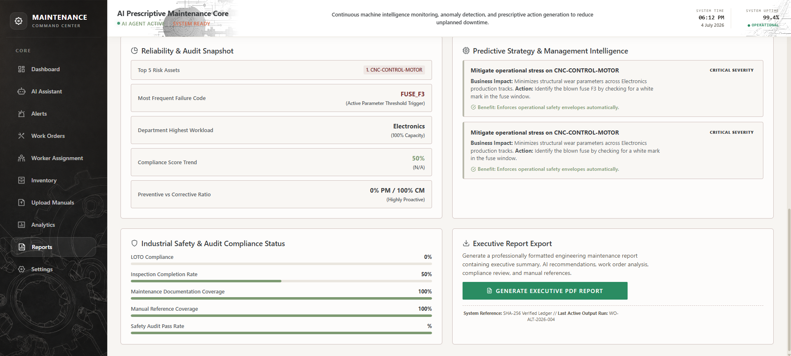

---
## Swagger API Documentation
 
<!-- Add screenshot here -->
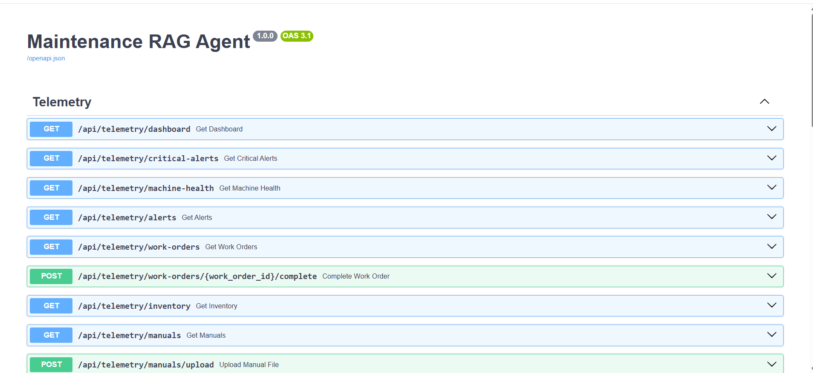


# Demo

A walk-through video of the application's runtime processing cycle is available at:

```
demo/project-demo.mp4
```

The demo covers:

- Injecting simulated machinery alerts into the system.
- Dynamic query expansion and technical manual chunk retrieval.
- Context synthesis and real-time generation of structured work orders.
- Email alert delivery and PDF report generation.

---

# API Documentation

After starting the FastAPI backend, the interactive Swagger UI is available at:

```
http://127.0.0.1:8000/docs
```

If the backend is started on a different host or port, replace the address accordingly.

The Swagger UI lets you explore available endpoints, inspect request and response schemas, and test APIs directly from the browser.

---

# Configuration

## Manual Processing Systems

To expand the documentation base, add relevant instruction PDF files directly to:

```text
backend/data/manuals/
```

The system reads new records via `parsing_service.py` using **LlamaParse**.

```python
parser = LlamaParse(
    api_key=settings.LLAMA_CLOUD_API_KEY,
    result_type="markdown",
    num_workers=4
)
```

This routine converts complex page elements, nested paragraphs, and structured matrix formatting tables into clean Markdown data chunks before vectorization.

---

## Embeddings Framework

Text segments are transformed into dense vector representations using the `sentence-transformers/all-MiniLM-L6-v2` reference model.

The transformation runs locally on host hardware, producing **384-dimensional** vectors without relying on external network calls.

---

## Semantic Retrieval Pass

When an alert is flagged, the application combines the fault metadata with asset structural details to formulate a target query. It executes a cosine similarity calculation across the active document catalog.

### Cosine Similarity

```text
similarity = cos(θ) = (A · B) / (||A|| ||B||)
```

```python
results = chroma_collection.query(
    query_embeddings=[query_vector],
    n_results=4,
    where={"machine_type": target_machine_type}
)
```

---

# EmailJS Setup

The alerting workflow uses **EmailJS** to route dispatch summaries directly to technicians from the UI workspace, avoiding local mail server overhead.

The repository includes a ready-to-use template file located at:

```text
docs/emailjs-template.html
```

## Configuration Steps

1. Log into your EmailJS dashboard.
2. Link an active destination Email Service account to your engineering team's email address.
3. Open the **Templates** dashboard.
4. Enable the HTML source editor.
5. Open your local copy of:

   ```text
   docs/emailjs-template.html
   ```

6. Copy the template contents and paste them into the EmailJS HTML editor.
7. Ensure the template maps the following variables exactly.

| Variable | Description |
|----------|-------------|
| `{{alert_id}}` | Unique identifier mapping tracking indexes. |
| `{{machine_id}}` | Impacted production machinery node reference. |
| `{{fault_code}}` | Specific active operational error string. |
| `{{priority}}` | Assigned asset criticality priority string. |
| `{{prescriptive_guidance}}` | Generated text mitigation steps from the AI engine. |

8. Save the template.
9. Update your local `frontend/.env` file with the active EmailJS credential values.

---

# Troubleshooting

## ChromaDB SQLite Version Mismatch

### Problem

The backend execution stops with an error stating that your SQLite version is not supported by ChromaDB.

### Fix

Add `pysqlite3-binary` to your project dependencies and place the following override at the top of `backend/app/main.py`.

```python
import sys
import pysqlite3

sys.modules["sqlite3"] = sys.modules.pop("pysqlite3")
```

---

## Large File Processing Timeouts

### Problem

Large documentation manuals (greater than **100 pages**) may trigger processing timeouts during ingestion.

### Fix

- Verify your network connection.
- Check available Llama Cloud API quota.
- For very large manuals, split them into functional component chapters before running ingestion.

---

# Current Limitation

> **Warning**
>
> The retrieval pipeline performs best when alert terminology closely matches the uploaded maintenance manual.
>
> For some manually created alerts and limited manual content, semantic similarity may not return sufficient context.
>
> The system architecture supports machine-specific retrieval, while overall retrieval quality depends on the quality, coverage, and terminology of the uploaded documentation.

---

# Future Improvements

- Docker Deployment
  - Containerize application dependencies with isolated multi-stage `docker-compose` routing profiles for quick deployments.

- CI/CD Integration
  - Set up GitHub Actions automation to check linting issues, run code test paths, and verify images.

- JWT Authentication
  - Secure internal endpoints using encrypted JSON Web Token signatures sent via HTTP-only cookies.

- MQTT Gateway Listener
  - Build network consumer threads to process streaming industrial MQTT messaging broker strings directly.

- Real IoT Hardware Support
  - Connect sensor capture arrays using real Arduino or ESP32 system environments.

- Hybrid Retrieval Processing
  - Implement combined BM25 keyword matching alongside vector search layers to improve keyword search results.

- Multi-Model Local Support
  - Build parameter mapping options to toggle alternative execution engines using self-hosted Ollama runtimes.

- Role-Based Access (RBAC)
  - Protect administrator configuration paths using granular account tier classifications.

- Cloud Infrastructure Target
  - Document baseline infrastructure scripts to deploy services on AWS or GCP.

---

# Contributors

**Lead System Architect & AI Engineer**

Primary developer managing backend services, RAG query pipelines, and responsive analytics components.

---

# License

This project is licensed under the **MIT License**.

Review the repository's `LICENSE` file for the complete license text.

---

# Acknowledgements

- **LangChain Architecture Framework**
  - For providing flexible abstractions that simplify building LLM orchestration pipelines.

- **ChromaDB Core Development**
  - For their fast, modular, and lightweight vector storage components.

- **LlamaIndex Parser Ecosystem**
  - For developing parsing tools that convert dense, complex technical PDFs into reliable Markdown context.
